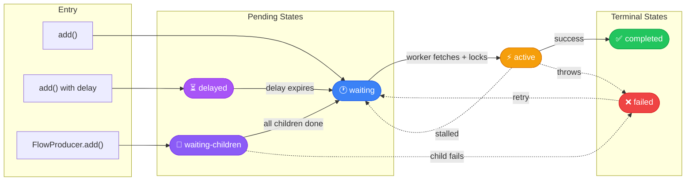
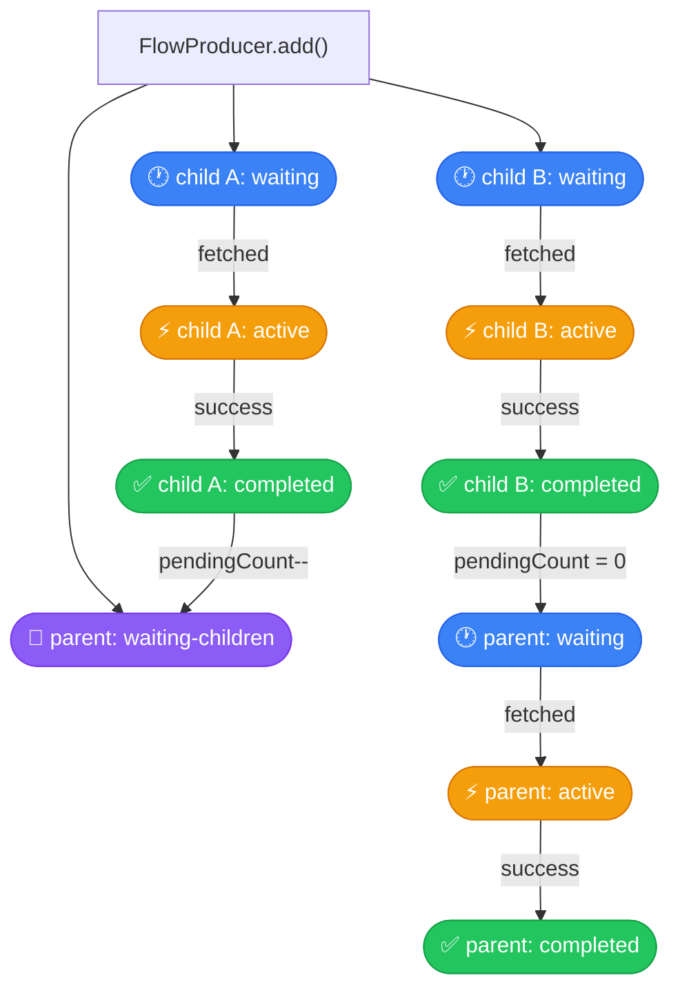

# Job Lifecycle

Every job in Conveyor passes through a well-defined set of states. Understanding these transitions
is essential for building reliable job processing pipelines, handling failures gracefully, and
working with job flows (parent-child dependencies).

## Job States

A job can be in one of six states:

| State              | Description                                                  |
| ------------------ | ------------------------------------------------------------ |
| `waiting`          | Ready to be picked up by a worker                            |
| `waiting-children` | Parent job waiting for all children to complete (flows only) |
| `delayed`          | Scheduled for future processing; not yet eligible            |
| `active`           | Currently being processed by a worker                        |
| `completed`        | Successfully processed                                       |
| `failed`           | Processing failed (may be retried)                           |

## State Machine



## Adding Jobs

When you call `queue.add()`, the job enters either `waiting` or `delayed` depending on the options:

```ts
// Enters "waiting" immediately
await queue.add('send-email', { to: 'user@example.com' });

// Enters "delayed", promoted to "waiting" after 5 minutes
await queue.add('send-reminder', { to: 'user@example.com' }, {
  delay: '5 minutes',
});

// Enters "delayed", promoted on cron schedule
await queue.add('daily-report', {}, {
  repeat: { cron: '0 9 * * *', tz: 'America/New_York' },
});
```

## Delayed Job Promotion

Jobs added with a `delay` or `repeat` option start in the `delayed` state with a `delayUntil`
timestamp. The worker periodically calls `promoteDelayedJobs()` on the store, which transitions all
jobs whose `delayUntil` has passed to `waiting`.

```
[delayed] ──delayUntil <= now──→ [waiting]
```

For cron jobs, after each execution completes, the worker calculates the next cron tick and creates
a new `delayed` job automatically.

## Fetching and Locking

When a worker is ready for work, it calls `fetchNextJob()` on the store. This operation is
**atomic** -- it selects a `waiting` job and sets its state to `active` with a lock in one
transaction. This prevents two workers from claiming the same job.

The fetch respects:

- **Priority**: lower number = higher priority (default: 0)
- **FIFO/LIFO ordering**: FIFO by default, LIFO if configured
- **Paused job names**: skips paused job names
- **Global concurrency**: checks total active count before fetching

```ts
const worker = new Worker('emails', async (job) => {
  await sendEmail(job.data.to, job.data.subject);
}, {
  store,
  concurrency: 5, // max 5 concurrent jobs on this worker
  maxGlobalConcurrency: 20, // max 20 active across all workers
});
```

## Lock Renewal

While a job is `active`, the worker holds a lock with a configurable duration (default: 30 seconds).
For long-running jobs, the worker automatically renews the lock at regular intervals to prevent
stalled detection from reclaiming it.

```
Worker processing job
├── t=0s    lock acquired (lockUntil = now + 30s)
├── t=15s   lock renewed  (lockUntil = now + 30s)
├── t=30s   lock renewed  (lockUntil = now + 30s)
└── t=40s   job completes, lock released
```

The lock duration and renewal interval are configurable via `WorkerOptions`:

```ts
const worker = new Worker('videos', processVideo, {
  store,
  lockDuration: 60_000, // 60-second locks for long jobs
  stalledInterval: 30_000, // check for stalled jobs every 30s
});
```

## Stalled Job Detection

A job is considered **stalled** when its lock expires while it is still in the `active` state. This
typically means the worker crashed or became unresponsive.

The stalled detection cycle:

1. Worker periodically calls `getStalledJobs()` on the store
2. Jobs where `lockUntil < now` and `state = active` are returned
3. Stalled jobs are re-enqueued back to `waiting`
4. A `stalled` event is emitted

Stalled detection prevents jobs from being lost when workers die unexpectedly. The re-enqueued job
will be picked up by another (or the same) worker and processed from scratch.

## Retries and Backoff

When a processor throws an error, the job transitions to `failed`. If the job has remaining retry
attempts, it is automatically re-enqueued to `waiting` with a backoff delay.

```ts
await queue.add('unreliable-api', { url: '...' }, {
  attempts: 5,
  backoff: {
    type: 'exponential', // fixed, exponential, or custom
    delay: 1000, // base delay in ms
  },
});
```

| Strategy      | Delay Formula                  | Example (base=1s) |
| ------------- | ------------------------------ | ----------------- |
| `fixed`       | `delay`                        | 1s, 1s, 1s, 1s    |
| `exponential` | `delay * 2^(attempt-1)`        | 1s, 2s, 4s, 8s    |
| `custom`      | `customStrategy(attemptsMade)` | (user-defined)    |

The retry flow:

```
[active] ──failure──→ [failed]
                         │
            attemptsMade < attempts?
               yes ──→ [delayed] (with backoff) ──→ [waiting]
               no  ──→ stays [failed]
```

## Job Completion

When the processor function returns successfully:

1. The job state changes to `completed`
2. The return value is stored as `returnvalue`
3. The `completedAt` timestamp is set
4. A `completed` event is emitted
5. If `removeOnComplete` is set, the job is removed (or scheduled for removal after a grace period)

## Flow Lifecycle (Parent-Child Dependencies)

Flows allow you to create dependency trees where parent jobs wait for their children to finish. The
`FlowProducer` saves the entire tree atomically.

```ts
import { FlowProducer } from '@conveyor/core';

const flow = new FlowProducer({ store });
const result = await flow.add({
  name: 'send-report',
  queueName: 'reports',
  data: { reportId: 42 },
  children: [
    { name: 'fetch-data', queueName: 'etl', data: { source: 'db' } },
    { name: 'fetch-data', queueName: 'etl', data: { source: 'api' } },
  ],
});
```

### Flow State Transitions



### How It Works

1. `FlowProducer.add()` flattens the tree and saves all jobs atomically via `saveFlow()`
2. Children start in `waiting`; the parent starts in `waiting-children`
3. The parent has a `pendingChildrenCount` equal to its number of direct children
4. As each child completes, `notifyChildCompleted()` decrements the counter
5. When `pendingChildrenCount` reaches 0, the parent transitions to `waiting`
6. The parent is then processed like any normal job

### Child Failure Policies

The `failParentOnChildFailure` option controls what happens when a child fails:

| Policy     | Behavior                                             |
| ---------- | ---------------------------------------------------- |
| `'fail'`   | Parent immediately transitions to `failed` (default) |
| `'ignore'` | Parent proceeds when remaining children finish       |
| `'remove'` | Parent is removed if any child fails                 |

## Event Types

Throughout the lifecycle, events are emitted both locally (via `EventBus`) and through the store's
pub/sub mechanism:

| Event              | When                                   |
| ------------------ | -------------------------------------- |
| `waiting`          | Job added or re-enqueued               |
| `waiting-children` | Parent job created in a flow           |
| `delayed`          | Job scheduled for future processing    |
| `active`           | Worker picks up a job                  |
| `completed`        | Job processed successfully             |
| `failed`           | Job processing failed                  |
| `progress`         | Job reports progress update            |
| `stalled`          | Active job's lock expired, re-enqueued |
| `removed`          | Job removed from the store             |
| `drained`          | Queue has no more waiting jobs         |
| `paused`           | Queue or job name paused               |
| `resumed`          | Queue or job name resumed              |
| `cancelled`        | Job was cancelled                      |
| `error`            | An error occurred in the queue/worker  |

## Related Pages

- [Architecture](/concepts/architecture) -- how core and stores are decoupled
- [Stores](/concepts/stores) -- how each backend implements locking and events
- [Multi-Runtime Support](/concepts/multi-runtime) -- runtime compatibility
- [Getting Started](/guide/getting-started) -- quick setup guide
